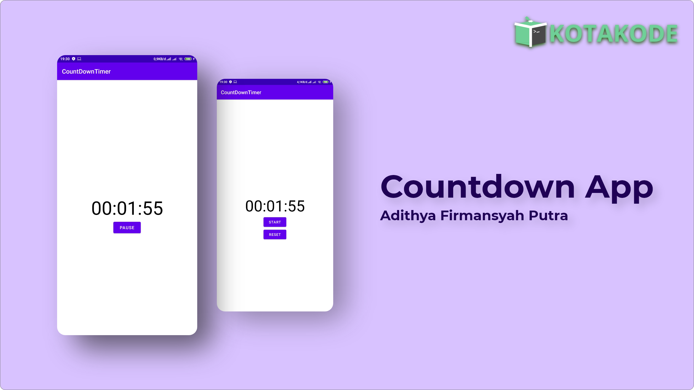

<h1 align="center">
  Kotakode's Serial Blog : Countdown App
</h1>
<p align="center">
  Countdown App : Serial Blogs in Kotakode.
</p>
<p align="center">
  <a href="http://developer.android.com/index.html"></a>
  <a href="http://kotlinlang.org"></a>
  <a href="https://developer.android.com/studio/releases/gradle-plugin"></a>
  <a href="https://github.com/Adithya-13/CountDownTimerKotakode/"></a>
</p>

<p align="center">
  
</p>

## Table of Contents
- [Introduction](#introduction)
- [Installation](#installation)
- [Demo](#demo)

## Introduction

This project is made for Kotakode's Serial Blog in here 

* [Persiapan Membuat Countdown App - Part 1](https://kotakode.com/blogs/4265/Persiapan-Membuat-Countdown-App---Part-1)
* [Start, Pause, Reset Countdown App - Part 2](https://kotakode.com/blogs/4268/Start%2C-Pause%2C-Reset-Timer-Countdown-App---Part-2)
* [TimePicker pada Countdown App - Part 3](https://kotakode.com/blogs/4271/TimePicker-pada-Countdown-App---Part-3)
* [Dynamic Time pada Countdown App - Part 4](https://kotakode.com/blogs/4273/Menerapkan-Dynamic-Time-Countdown-App---Part-4)

I Hope this project is help people for who need to learn somethings in Android Development.

## Installation

Clone or Download and Open it into Android Studio
```
    https://github.com/Adithya-13/CountDownTimerKotakode.git
```  

## Demo


